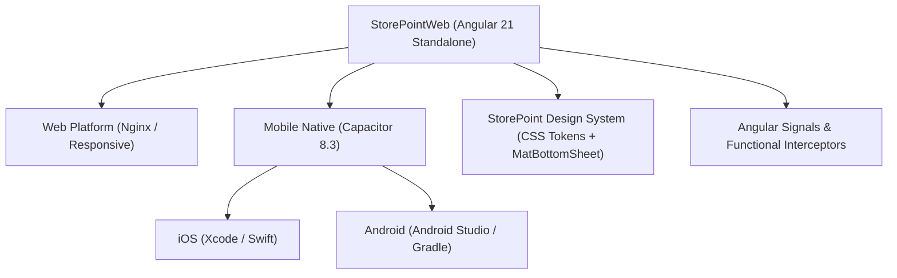

# 🏪 StorePointWeb — Base de Conocimiento (Obsidian Vault)

Bienvenido a la bóveda de documentación central de **StorePointWeb**. Este espacio está estructurado siguiendo las **mejores prácticas de gestión del conocimiento de Obsidian (MOCs, PARA híbrido, propiedades normalizadas y enlaces bidireccionales)** para mantener sincronizada la arquitectura, el diseño y las decisiones del proyecto con el código fuente.

---

## 🗺️ Mapa de Contenidos Principal (MOCs)

Explora la base de conocimiento a través de los centros neurálgicos del proyecto:

| Sección | Descripción | Acceso Directo |
| :--- | :--- | :--- |
| 🏛️ **Arquitectura** | Fundamentos técnicos, Angular 21 Signals, Capacitor 8, State y Storage. | [[Architecture MOC]] |
| 🎨 **Design System** | Tokens SCSS, temas claro/oscuro, reglas estrictas de UI y catálogo de componentes. | [[Design System MOC]] |
| 📦 **Funcionalidades (Features)** | Módulos de negocio: Punto de Venta (POS), Órdenes, Créditos, Proveedores, Caja. | [[Features MOC]] |
| 📜 **Reglas de Negocio (BRD)** | **Fórmulas financieras, transiciones de estado y políticas del negocio**. | [[Reglas-De-Negocio]] |
| ⚖️ **Decisiones de Arquitectura** | Registros ADR (Architecture Decision Records) con el histórico de decisiones clave. | [[Decisions MOC]] |
| 📚 **Guías y Flujos** | Onboarding, compilación nativa iOS/Android, estándares de testing y creación de UI. | [[Guides MOC]] |
| 🧭 **Lienzo Global (Canvas)** | Diagrama espacial e interactivo de todo el sistema en Obsidian Canvas. | [[StorePoint Architecture.canvas]] |
| 🗺️ **Mapa de Todos los Componentes (Canvas)** | **Mapa interactivo de los 48 componentes** y todas sus conexiones. | [[Mapa-Relaciones-Todos-Los-Componentes.canvas]] |
| ⚡ **Lienzo de Flujo (Canvas)** | Flujo canónico: Componente ↔ Servicio ↔ Modelo ↔ Drawers. | [[Flujo-Componente-Servicio-Modelo.canvas]] |
| 📊 **Matriz de Componentes** | Tabla y análisis de relaciones de cada componente del código. | [[Mapa-Completo-De-Componentes]] |

---

## ⚡ Vista Rápida del Stack Tecnológico



- **Framework**: Angular 21 (100% componentes Standalone, sin `NgModule`)
- **Estado**: Angular Signals (`signal`, `computed`, `effect`)
- **Móvil Híbrido**: Capacitor 8.3 (Detección dinámica en `StorageService`)
- **Estilos**: SCSS con CSS Custom Properties (temas `light` y `dark`)
- **Pruebas y Linter**: Vitest, ESLint + Angular-ESLint

---

## 📌 Guía Rápida de Comandos del Proyecto

```bash
# Desarrollo local (Web)
npm start              # Inicia servidor dev en http://localhost:4200

# Calidad de código
npm test               # Ejecuta tests unitarios con Vitest
npm run lint           # Revisa ESLint en TypeScript y plantillas HTML
npm run build          # Compilación para producción

# Plataformas Móviles (Capacitor)
npm run cap:sync       # Compila y sincroniza código con iOS/Android
npm run cap:ios        # Abre proyecto en Xcode
npm run cap:android    # Abre proyecto en Android Studio
```

---

## 🎯 Reglas de Oro de esta Bóveda (Obsidian Best Practices)

1. **Usa enlaces bidireccionales (`[[NombreDeNota]]`)**: No crees islas de información. Conecta cada componente, decisión o guía a su respectivo MOC.
2. **Carpetas para categorías, Enlaces para relaciones**: Las carpetas solo ordenan el ciclo de vida y dominio. Las relaciones se trazan con Wikilinks.
3. **Mantén el YAML Frontmatter**: Todas las notas deben incluir `title`, `type`, `status` y `tags`.
4. **Registra las decisiones en ADRs**: Si cambias una librería o patrón de arquitectura, crea un nuevo archivo en [[Decisions MOC]] usando [[ADR-Template]].
5. **No guardes archivos temporales en Git**: `.obsidian/workspace.json` y cachés ya están excluidos en `.gitignore`.

---

## 🔍 Búsqueda Rápida por Tags
- `#feature`: Notas sobre casos de uso y módulos funcionales.
- `#architecture`: Decisiones de diseño de software y patrones.
- `#design-system`: Tokens, estilos, componentes `stp-*`.
- `#adr`: Registros de decisión arquitectónica.
- `#guide`: Manuales paso a paso de desarrollo.
