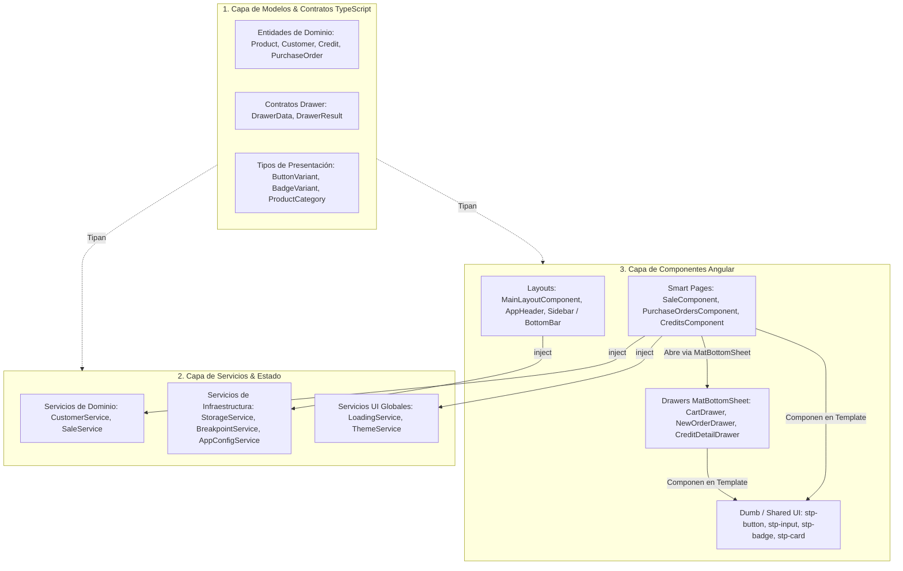
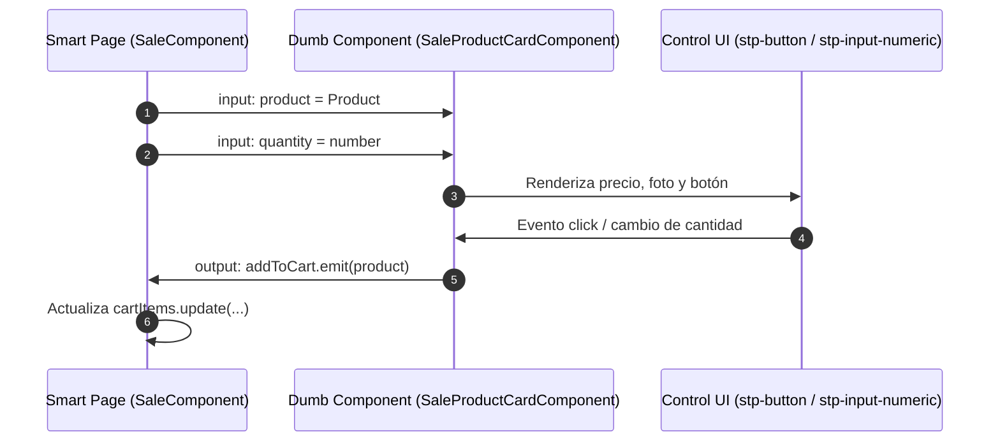
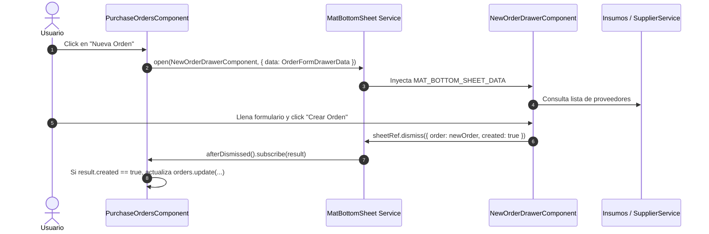
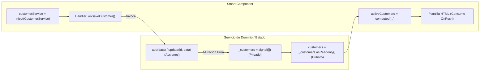
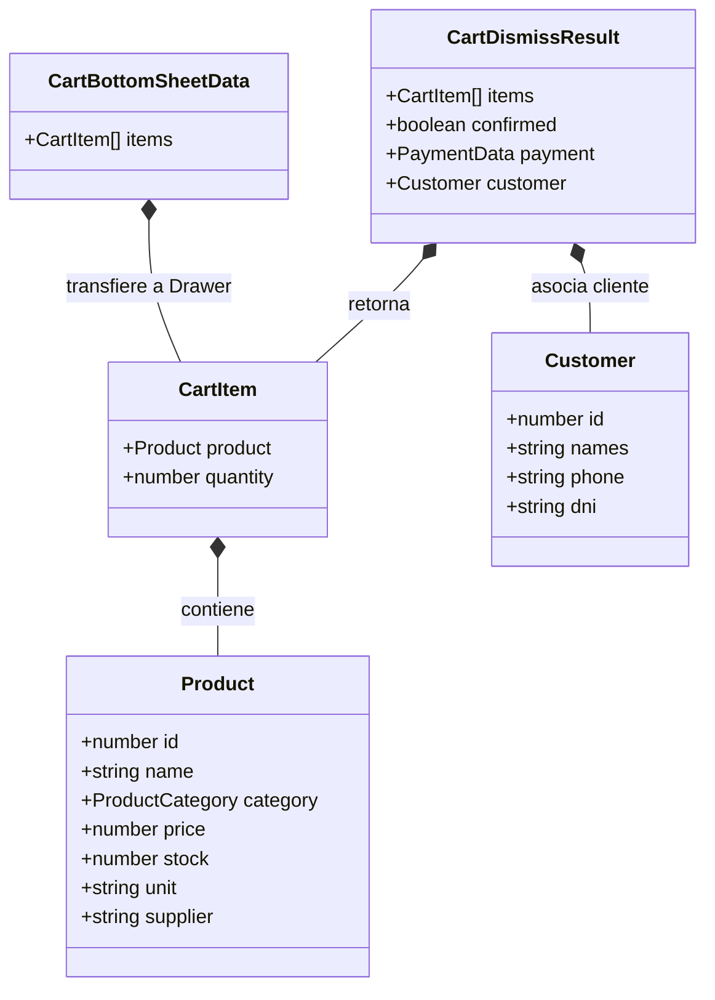

# 🏗️ Arquitectura de Relaciones: Componentes, Servicios, Modelos e Interfaces

Este documento detalla cómo interactúan y se comunican entre sí los **Componentes**, **Servicios**, **Modelos** e **Interfaces** en **StorePointWeb**, siguiendo las mejores prácticas de Angular 21 Standalone y Signals.

---

## 🗺️ Visión General: Las 3 Capas de la Aplicación



---

## 🧩 1. Relación Entre Componentes (Component-to-Component)

En StorePointWeb existen tres niveles principales de componentes y dos mecanismos de comunicación entre ellos:

### A. Jerarquía de Composición: Smart vs Dumb
1. **Smart Components (Páginas / Contenedores)**:
   - *Ejemplos*: `SaleComponent`, `PurchaseOrdersComponent`, `CreditsComponent`.
   - *Rol*: Conocen el contexto de negocio, inyectan servicios (`inject()`), administran Signals de página y orquestan la apertura de drawers.
2. **Dumb / Presentational Components (UI Compartida `stp-*`)**:
   - *Ejemplos*: `<stp-button>`, `<stp-input>`, `<stp-badge>`, `<stp-card>`.
   - *Rol*: Son 100% agnósticos de la lógica de negocio. Reciben datos mediante `input()` y emiten eventos de usuario mediante `output()`.
   - *Formularios*: Implementan `ControlValueAccessor` (CVA) para enlazarse limpiamente con `[(value)]` o `ReactiveFormsModule`.



---

### B. Comunicación Desacoplada de Drawers (`MatBottomSheet`)
En lugar de incrustar diálogos pesados o modales condicionales (`*ngIf="showModal"`) en el template del padre, los drawers se invocan dinámicamente mediante **`MatBottomSheet`**.



**Beneficios arquitectónicos:**
- Desacoplamiento total: El componente padre no renderiza el DOM del modal hasta que se abre.
- Aislamiento de estado: El drawer tiene su propio ciclo de vida e inputs limpios tipados mediante contratos de TypeScript.

---

## ⚡ 2. Relación Componente ↔ Servicios (Component-to-Service)

La comunicación entre componentes y servicios sigue un **Flujo de Datos Unidireccional Reactivo** basado en Signals:



### Tipos de Servicios y su Integración con Componentes

| Categoría | Servicio | Cómo se Relaciona con los Componentes |
| :--- | :--- | :--- |
| **Dominio** | `CustomerService` | Expone signals de solo lectura (`customers`) y métodos atómicos (`add`, `update`, `search`). Los componentes consumen los datos con `computed()`. |
| **Infraestructura** | `StorageService` | Desacopla la persistencia. Detecta si la app corre en iOS/Android nativo (`@capacitor/preferences`) o Web (`localStorage`). Los componentes nunca tocan `window.localStorage`. |
| **UI Global** | `LoadingService` | Posee un contador numérico concurrente (`counter = signal(0)`). El interceptor HTTP `loadingInterceptor` lo incrementa en cada petición; `LoaderComponent` escucha reactivamente si `isLoading = counter > 0`. |
| **UI Global** | `ThemeService` | Administra el signal `theme` (`'light' \| 'dark'`). Modifica el atributo `data-theme` en `<html>` y persiste el estado automáticamente con un `effect()`. |
| **Layout** | `BreakpointService` | Escucha media queries de pantalla. `MainLayoutComponent` lo usa para alternar dinámicamente entre `SidebarComponent` (Desktop) y `BottomBarComponent` (Móvil). |

---

## 📐 3. Relación de Modelos, Interfaces y Tipos de Datos

Para evitar el acoplamiento rígido, los tipos de TypeScript se dividen en 4 responsabilidades bien definidas:



### Clasificación de Interfaces en el Proyecto:

1. **Entidades de Dominio (Domain Entities)**:
   - Representan los conceptos fundamentales del negocio.
   - *Ejemplos*: `Product` (en `sale.data.ts`), `Customer` (en `customer.service.ts`), `PurchaseOrder` (en `purchase-orders.data.ts`), `Credit` (en `credits.data.ts`).
2. **Contratos de Comunicación de Drawers (I/O Contracts)**:
   - Tipos explícitos para lo que entra (`*Data`) y lo que sale (`*Result`) de un modal.
   - *Ejemplos*: `CartBottomSheetData` / `CartDismissResult`, `OrderFormDrawerData` / `OrderFormDrawerResult`.
3. **Modelos de Mutación y Formularios (DTOs)**:
   - Usan utilidades de TypeScript (`Omit`, `Partial`, `Pick`) para garantizar que la creación no exija IDs autonuméricos del backend.
   - *Ejemplo*: `Omit<Customer, 'id'>` en `CustomerService.add()`.
4. **Tipos de Presentación de UI**:
   - Enums o Union Types que restringen variantes de diseño.
   - *Ejemplos*: `BadgeVariant` (`'success' | 'warning' | 'danger'`), `ButtonVariant`, `ProductCategory`.

---

## 🚀 Resumen del Ciclo de Vida de una Petición / Interacción

```text
[1. Usuario hace clic en UI]
         │
         ▼
[2. stp-button / stp-input emite output]
         │
         ▼
[3. Smart Component maneja el evento]
         ├── Si requiere vista compleja ──> Abre MatBottomSheet con DrawerData
         └── Si es una acción directa    ──> Invoca método en el Servicio
                                                      │
                                                      ▼
                                       [4. Servicio ejecuta lógica]
                                                      ├── Lanza HTTP (loadingInterceptor activa LoadingService)
                                                      └── Muta Signal interno (_state.update)
                                                                      │
                                                                      ▼
                                                       [5. Signals de solo lectura emiten]
                                                                      │
                                                                      ▼
                                                       [6. computed() en componentes se recalculan]
                                                                      │
                                                                      ▼
                                                       [7. Template OnPush se actualiza en el DOM]
```

---

## 🔗 Referencias
- [[Architecture MOC]]
- [[State Management]]
- [[Design System/Modal & Drawer Pattern]]
- [[UI Components Catalog]]
