# 🗺️ Mapa Completo de Relaciones Entre Todos los Componentes

Este documento presenta el **mapa exhaustivo de los 48 componentes** de **StorePointWeb**, clasificando sus dependencias directas, sus componentes hijos, los padres que los consumen y los servicios que inyectan.

> [!TIP]
> Puedes explorar este mapa de forma gráfica e interactiva en Obsidian Canvas abriendo:
> 🧭 [[Mapa-Relaciones-Todos-Los-Componentes.canvas]]

---

## 🏗️ Diagrama de Familias y Jerarquías de Componentes

```mermaid
flowchart TD
    subgraph S1 [1. Shell & Layout]
        App[AppComponent stp-root]
        MainLayout[MainLayoutComponent]
        AppHeader[AppHeaderComponent]
        Sidebar[SidebarComponent Desktop]
        BottomBar[BottomBarComponent Mobile]
        AppFooter[AppFooterComponent]
    end

    subgraph S2 [2. Smart Pages Rutas]
        Sale[SaleComponent /sale]
        Orders[PurchaseOrdersComponent /purchase-orders]
        Credits[CreditsComponent /credits]
        Suppliers[SuppliersComponent /suppliers]
        Caja[CajaComponent /caja]
        Dashboard[DashboardComponent /dashboard]
        Login[LoginComponent /login]
        Profile[ProfileComponent /profile]
        Notices[NoticesComponent /notices]
        Demo[DemoComponent /demo]
    end

    subgraph S3 [3. Overlays y Drawers MatBottomSheet]
        CartDrawer[CartDrawerComponent]
        CartStep[CartStepComponent]
        CustStep[CustomerStepComponent]
        PayStep[PaymentStepComponent]
        NewOrderDrawer[NewOrderDrawerComponent]
        OrderDetailDrawer[PurchaseOrderDetailDrawerComponent]
        CreditDrawer[CreditDrawerComponent]
        CreditDetailDrawer[CreditDetailDrawerComponent]
        SupplierDrawer[SupplierDrawerComponent]
        InvDrawer[InventoryDrawerComponent]
    end

    subgraph S4 [4. Tarjetas Compuestas]
        SaleProductCard[SaleProductCardComponent]
        ProductCard[ProductCardComponent]
        CartItemComp[CartItemComponent]
    end

    subgraph S5 [5. Shared UI Controls & Feedback stp-*]
        Btn[ButtonComponent stp-button]
        Inp[InputComponent stp-input]
        InpNum[InputNumericComponent stp-input-numeric]
        Sel[SelectComponent stp-select]
        Chk[CheckboxComponent stp-checkbox]
        Srch[SearchComponent stp-search]
        Bdg[BadgeComponent stp-badge]
        Tag[TagComponent stp-tag]
        Alrt[AlertComponent stp-alert]
        Avt[AvatarComponent stp-avatar]
        Crd[CardComponent stp-card]
        Shm[ShimmerComponent stp-shimmer]
        Emp[EmptyStateComponent stp-empty-state]
        Ldr[LoaderComponent stp-loader]
        Tbs[TabsComponent stp-tabs]
        Swp[SwipeItemComponent stp-swipe-item]
        Icn[IconComponent stp-icon]
    end

    App --> Ldr
    App --> MainLayout
    MainLayout --> AppHeader
    MainLayout --> Sidebar
    MainLayout --> BottomBar
    MainLayout --> AppFooter
    MainLayout --> S2

    Sale --> CartDrawer
    Sale --> SaleProductCard
    SaleProductCard --> ProductCard
    SaleProductCard --> InpNum
    SaleProductCard --> Btn

    CartDrawer --> CartStep
    CartDrawer --> CustStep
    CartDrawer --> PayStep
    CartStep --> CartItemComp
    CartStep --> Swp
    CartItemComp --> InpNum

    Orders --> NewOrderDrawer
    Orders --> OrderDetailDrawer
    Orders --> Bdg
    Orders --> Inp
    Orders --> Srch

    Credits --> CreditDrawer
    Credits --> CreditDetailDrawer
    Credits --> Tbs
    Credits --> Alrt

    Suppliers --> SupplierDrawer
    Suppliers --> Swp
    InvDrawer --> SupplierDrawer

    S2 --> Btn
    S3 --> Btn
    S5 --> Icn
```

---

## 📊 Matriz Exhaustiva de Componentes (48 Componentes)

### 1. Núcleo, Shell y Layouts (6 componentes)
| Componente | Selector | Ubicación | Componentes que Usa (Hijos) | Consumido Por (Padres) | Servicios Inyectados |
| :--- | :--- | :--- | :--- | :--- | :--- |
| **`AppComponent`** | `stp-root` | `src/app/app.ts` | `LoaderComponent` | Root Angular | - |
| **`MainLayoutComponent`** | `stp-main-layout` | `shared/layouts/main-layout/` | `AppHeaderComponent`, `SidebarComponent`, `BottomBarComponent`, `AppFooterComponent` | `app.routes.ts` | `BreakpointService` |
| **`AppHeaderComponent`** | `stp-app-header` | `shared/components/app-header/` | `ButtonComponent`, `IconComponent` | `MainLayoutComponent` | `ThemeService`, `Router` |
| **`SidebarComponent`** | `stp-sidebar` | `shared/components/sidebar/` | `IconComponent` | `MainLayoutComponent` | `Router` |
| **`BottomBarComponent`** | `stp-bottom-bar` | `shared/components/bottom-bar/` | `IconComponent` | `MainLayoutComponent` | `Router` |
| **`AppFooterComponent`** | `stp-app-footer` | `shared/components/app-footer/` | - | `MainLayoutComponent` | `AppConfigService` |

---

### 2. Páginas de Funcionalidades / Smart Pages (10 componentes)
| Componente | Ruta | Componentes que Usa (Hijos) | Drawers que Dispara | Servicios Inyectados |
| :--- | :--- | :--- | :--- | :--- |
| **`SaleComponent`** | `/sale` | `SaleProductCardComponent`, `ProductCardComponent`, `CardComponent`, `ButtonComponent`, `ShimmerComponent`, `IconComponent` | `CartDrawerComponent` | `MatBottomSheet` |
| **`PurchaseOrdersComponent`** | `/purchase-orders` | `AvatarComponent`, `BadgeComponent`, `ButtonComponent`, `CardComponent`, `EmptyStateComponent`, `InputComponent`, `SearchComponent`, `ShimmerComponent`, `IconComponent` | `NewOrderDrawerComponent`, `PurchaseOrderDetailDrawerComponent` | `MatBottomSheet` |
| **`CreditsComponent`** | `/credits` | `AlertComponent`, `BadgeComponent`, `ButtonComponent`, `EmptyStateComponent`, `SearchComponent`, `TabsComponent`, `IconComponent` | `CreditDrawerComponent`, `CreditDetailDrawerComponent` | `MatBottomSheet` |
| **`SuppliersComponent`** | `/suppliers` | `ButtonComponent`, `SwipeItemComponent`, `IconComponent` | `SupplierDrawerComponent` | `MatBottomSheet` |
| **`CajaComponent`** | `/caja` | `IconComponent` | - | - |
| **`DashboardComponent`** | `/dashboard` | `IconComponent` | - | - |
| **`LoginComponent`** | `/login` | `InputComponent`, `ButtonComponent`, `IconComponent` | - | `ThemeService`, `AppConfigService` |
| **`ProfileComponent`** | `/profile` | `InputComponent`, `ButtonComponent`, `IconComponent` | - | `ThemeService`, `StorageService` |
| **`NoticesComponent`** | `/notices` | `ButtonComponent`, `IconComponent` | - | - |
| **`DemoComponent`** | `/demo` | *Todos los componentes UI compartidos para vitrina y pruebas* | - | - |

---

### 3. Drawers & Modales Asíncronos (12 componentes)
| Drawer / Step | Ubicación | Hijos que Renderiza | Componentes Padres |
| :--- | :--- | :--- | :--- |
| **`CartDrawerComponent`** | `shared/components/cart-drawer/` | `CartStepComponent`, `CustomerStepComponent`, `PaymentStepComponent`, `ButtonComponent` | Invocado por `SaleComponent` |
| **`CartStepComponent`** | `cart-drawer/cart-step/` | `CartItemComponent`, `SwipeItemComponent`, `ButtonComponent` | `CartDrawerComponent` |
| **`CustomerStepComponent`** | `cart-drawer/customer-step/` | `ButtonComponent`, `IconComponent` | `CartDrawerComponent` |
| **`PaymentStepComponent`** | `cart-drawer/payment-step/` | `ButtonComponent`, `IconComponent` | `CartDrawerComponent` |
| **`NewOrderDrawerComponent`** | `purchase-orders/new-order-drawer/` | `BadgeComponent`, `ButtonComponent`, `CardComponent`, `InputComponent`, `InputNumericComponent`, `SelectComponent`, `TagComponent` | Invocado por `PurchaseOrdersComponent` |
| **`PurchaseOrderDetailDrawerComponent`** | `purchase-orders/purchase-order-detail-drawer/` | `AvatarComponent`, `BadgeComponent`, `ButtonComponent`, `CardComponent`, `IconComponent` | Invocado por `PurchaseOrdersComponent` |
| **`CreditDrawerComponent`** | `shared/components/credit-drawer/` | `InputComponent`, `ButtonComponent`, `IconComponent` | Invocado por `CreditsComponent` |
| **`CreditDetailDrawerComponent`** | `shared/components/credit-detail-drawer/` | `CreditDetailStepComponent`, `CreditListStepComponent`, `AlertComponent`, `ButtonComponent`, `InputComponent` | Invocado por `CreditsComponent` |
| **`CreditDetailStepComponent`** | `credit-detail-drawer/detail-step/` | `ButtonComponent`, `IconComponent` | `CreditDetailDrawerComponent` |
| **`CreditListStepComponent`** | `credit-detail-drawer/list-step/` | `IconComponent` | `CreditDetailDrawerComponent` |
| **`SupplierDrawerComponent`** | `shared/components/supplier-drawer/` | `InputComponent`, `ButtonComponent`, `IconComponent` | Invocado por `SuppliersComponent`, `InventoryDrawerComponent` |
| **`InventoryDrawerComponent`** | `shared/components/inventory-drawer/` | `InputComponent`, `ButtonComponent`, `SupplierDrawerComponent` | Invocado en `/products` |

---

### 4. Tarjetas Compuestas de Dominio (3 componentes)
| Componente | Selector | Ubicación | Hijos que Usa | Padres que lo Consumen |
| :--- | :--- | :--- | :--- | :--- |
| **`SaleProductCardComponent`** | `stp-sale-product-card` | `shared/components/sale-product-card/` | `ProductCardComponent`, `InputNumericComponent`, `ButtonComponent` | `SaleComponent` |
| **`ProductCardComponent`** | `stp-product-card` | `shared/components/product-card/` | `CardComponent`, `IconComponent` | `SaleProductCardComponent`, `SaleComponent` |
| **`CartItemComponent`** | `stp-cart-item` | `shared/components/cart-item/` | `InputNumericComponent`, `ButtonComponent`, `IconComponent` | `CartStepComponent` |

---

### 5. Controles de Formulario Compartidos `stp-*` (6 componentes)
| Componente | Selector | CVA (Formularios) | Hijos que Usa | Padres más Frecuentes |
| :--- | :--- | :--- | :--- | :--- |
| **`ButtonComponent`** | `stp-button` | - | `IconComponent` | Usado en prácticamente todas las páginas y drawers |
| **`InputComponent`** | `stp-input` | `Sí` | `IconComponent` | `LoginComponent`, `NewOrderDrawer`, `CreditDrawer`, etc. |
| **`InputNumericComponent`** | `stp-input-numeric` | `Sí` | `IconComponent` | `SaleProductCard`, `CartItem`, `NewOrderDrawer` |
| **`SelectComponent`** | `stp-select` | `Sí` | `IconComponent` | `NewOrderDrawer`, `DemoComponent` |
| **`CheckboxComponent`** | `stp-checkbox` | `Sí` | - | `DemoComponent`, formularios de selección múltiple |
| **`SearchComponent`** | `stp-search` | `Sí` | `IconComponent` | `PurchaseOrdersComponent`, `CreditsComponent`, `SaleComponent` |

---

### 6. Display, Feedback & Primitivas (11 componentes)
| Componente | Selector | Propósito | Hijos que Usa | Padres |
| :--- | :--- | :--- | :--- | :--- |
| **`BadgeComponent`** | `stp-badge` | Estado de registros (success, warning, error) | - | `PurchaseOrders`, `Credits`, `NewOrderDrawer`, `Demo` |
| **`TagComponent`** | `stp-tag` | Chips y categorías seleccionables | `IconComponent` | `NewOrderDrawer`, `Demo` |
| **`AlertComponent`** | `stp-alert` | Banners de aviso contextual | `IconComponent` | `CreditsComponent`, `CreditDetailDrawer`, `Demo` |
| **`AvatarComponent`** | `stp-avatar` | Foto/iniciales de personas o clientes | - | `PurchaseOrders`, `PurchaseOrderDetailDrawer`, `Demo` |
| **`CardComponent`** | `stp-card` | Contenedor elevado de superficie | - | `PurchaseOrders`, `ProductCard`, `NewOrderDrawer`, `Demo` |
| **`ShimmerComponent`** | `stp-shimmer` | Esqueleto de carga visual | - | `SaleComponent`, `PurchaseOrdersComponent`, `Demo` |
| **`EmptyStateComponent`** | `stp-empty-state` | Estado sin resultados | `IconComponent` | `PurchaseOrdersComponent`, `CreditsComponent`, `Demo` |
| **`LoaderComponent`** | `stp-loader` | Spinner global reactivo | `IconComponent` | `AppComponent` (sincronizado con `LoadingService`) |
| **`TabsComponent`** | `stp-tabs` | Pestañas de filtrado | - | `CreditsComponent`, `Demo` |
| **`SwipeItemComponent`** | `stp-swipe-item` | Gesto de deslizamiento táctil | `IconComponent` | `CartStepComponent`, `SuppliersComponent` |
| **`IconComponent`** | `stp-icon` | **Primitiva Universal**: Iconos SVG del sistema | - | **Inyectado/usado por 37 componentes distintos** |

---

## 🔗 Referencias Relacionadas
- 🧭 Lienzo Gráfico en Obsidian: [[Mapa-Relaciones-Todos-Los-Componentes.canvas]]
- ⚡ Flujo de Código: [[Flujo-Componente-Servicio-Modelo.canvas]]
- 🏛️ MOC de Arquitectura: [[Architecture MOC]]
- 🎨 Catálogo de UI: [[Design System/UI Components Catalog]]
