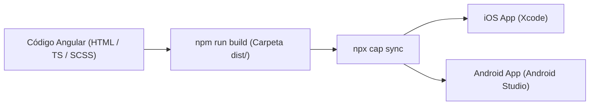

# 📱 Móvil & Capacitor 8

**StorePointWeb** está diseñado desde su núcleo como una aplicación web progresiva y aplicación móvil híbrida empaquetada mediante **Capacitor 8.3**.

---

## 🏗️ Flujo de Arquitectura Móvil



---

## 💾 Abstracción de Almacenamiento: `StorageService`
Ubicación: `src/app/core/services/storage.service.ts`.

> [!IMPORTANT]
> **Regla de oro**: Ningún componente o servicio de negocio debe invocar directamente `localStorage` ni `@capacitor/preferences`. Debe inyectar siempre `StorageService`.

- **Detección Dinámica**: `Capacitor.isNativePlatform()` evalúa en tiempo de ejecución si la app corre en un contenedor nativo (iOS o Android) o en un navegador web.
- **Rutas de Almacenamiento**:
  - En Web: Utiliza la API nativa del navegador `window.localStorage`.
  - En iOS/Android: Utiliza `@capacitor/preferences`, asegurando que los datos no se purguen con la memoria temporal del WebView del sistema operativo.

---

## 🎨 Consideraciones de Interfaz Móvil

1. **Safe Area Insets**:
   - Se respetan las muescas (notches) y barras de navegación del sistema operativo mediante variables CSS:
     ```scss
     padding-top: env(safe-area-inset-top);
     padding-bottom: env(safe-area-inset-bottom);
     ```
2. **Navegación Móvil Adaptativa**:
   - En pantallas móviles (`< 768px`), la barra lateral (`SidebarComponent`) se oculta y se activa `BottomBarComponent` en la parte inferior para fácil alcance con el pulgar.
3. **Overlays Móviles (Drawers)**:
   - Todo diálogo modal o formulario secundario se abre como un **Bottom Sheet** utilizando `MatBottomSheet` (ver [[Modal & Drawer Pattern]]), otorgando una experiencia nativa táctil en iOS y Android.

---

## 🚀 Comandos Esenciales de Capacitor

| Comando | Acción |
| :--- | :--- |
| `npm run cap:sync` | Compila la aplicación Angular para producción y copia los artefactos a `/ios` y `/android`. |
| `npm run cap:ios` | Sincroniza y abre el workspace en **Xcode**. |
| `npm run cap:android` | Sincroniza y abre el proyecto en **Android Studio**. |

---

## 🔗 Referencias
- [[Architecture MOC]]
- [[ADR-002 - Capacitor 8 for Native Mobile]]
- [[Mobile Build & Deploy (iOS-Android)]]
