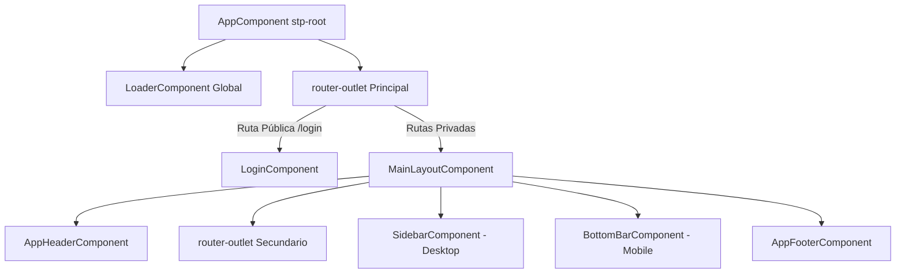

# 🧭 Enrutamiento & Navegación

Estructura de rutas y patrones de layouts en **StorePointWeb**.

---

## 🗺️ Mapa de Rutas de la Aplicación

Definido centralmente en `src/app/core/constants/app-routes.ts` y configurado en `src/app/app.routes.ts`:

| Ruta | Componente | Propósito | Layout |
| :--- | :--- | :--- | :--- |
| `/` | Redirección | Redirige por defecto a `/dashboard` | - |
| `/login` | `LoginComponent` | Autenticación y acceso al sistema | Vista Limpia (sin layout) |
| `/dashboard` | `DashboardComponent` | Panel de métricas e indicadores de rendimiento | `MainLayoutComponent` |
| `/sale` | `SaleComponent` | Terminal Punto de Venta (POS) y carrito de compras | `MainLayoutComponent` |
| `/products` | `ProductsComponent` | Catálogo de productos e inventario | `MainLayoutComponent` |
| `/purchase-orders`| `PurchaseOrdersComponent` | Gestión de órdenes de compra con proveedores | `MainLayoutComponent` |
| `/credits` | `CreditsComponent` | Control de créditos otorgados a clientes y cobranzas | `MainLayoutComponent` |
| `/suppliers` | `SuppliersComponent` | Directorio de proveedores y categorías de insumos | `MainLayoutComponent` |
| `/caja` | `CajaComponent` | Arqueo, aperturas, cierres y balance de caja chica | `MainLayoutComponent` |
| `/notices` | `NoticesComponent` | Avisos importantes y comunicados (placeholder) | `MainLayoutComponent` |
| `/profile` | `ProfileComponent` | Ajustes de usuario, sucursal y preferencias | `MainLayoutComponent` |
| `/demo` | `DemoComponent` | Vitrina del Sistema de Diseño (Design System Showcase)| `MainLayoutComponent` |

---

## 📐 Jerarquía de Layouts

---

## 🛡️ Guardias y Autenticación
- Actualmente las rutas privadas utilizan la estructura de `MainLayoutComponent`.
- La integración con el backend de autenticación (`AuthService`) se encuentra identificada con TODOs en `login.component.ts` y `main-layout.component.ts` para conectar JWT tokens y refresh tokens.

---

## 🔗 Referencias
- [[Architecture MOC]]
- [[Features MOC]]
