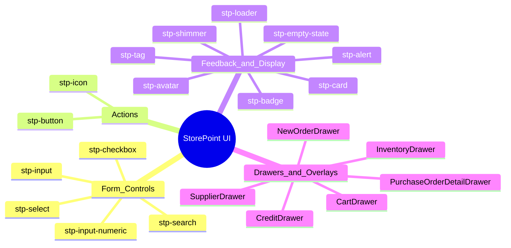

# 🎨 Design System Map of Content (MOC)

Bienvenido a la documentación del **Sistema de Diseño de StorePointWeb**. Este sistema garantiza coherencia visual, accesibilidad y experiencia de usuario fluida tanto en navegadores de escritorio como en aplicaciones móviles nativas.

---

## 📑 Documentos del Sistema de Diseño

| Documento | Descripción | Importancia |
| :--- | :--- | :--- |
| [[UI System Rules]] | **Reglas obligatorias** que todo desarrollador debe seguir en plantillas y SCSS. | 🚨 Crítica |
| [[Tokens & Theming]] | Variables CSS de color, tipografía, radios, sombras y soporte para modo oscuro. | 🎨 Esencial |
| [[UI Components Catalog]] | Catálogo completo de componentes compartidos (`stp-*`) con ejemplos de uso. | 📦 Referencia |
| [[Modal & Drawer Pattern]] | Arquitectura y patrón estándar para modales y drawers con `MatBottomSheet`. | 🏗️ Arquitectura |

---

## 🎯 Demostración Interactiva en Vivo

El proyecto cuenta con una ruta interactiva en vivo donde se renderizan todos los componentes en todas sus variantes y estados:
👉 **Ruta**: `/demo` (`src/app/features/demo/demo.component.ts`)

---

## 🧩 Resumen de Componentes Compartidos

---

## 🔗 Referencias Rápidas
- 🏠 Volver al inicio: [[00 - Home (Dashboard)]]
- 🏛️ Arquitectura: [[Architecture MOC]]
- 📦 Funcionalidades: [[Features MOC]]
