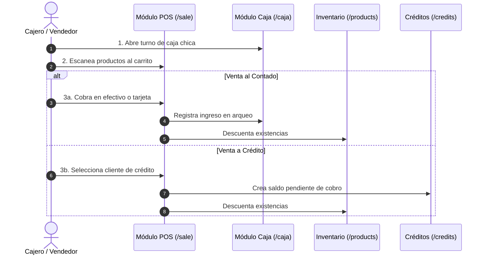

# 📦 Features Map of Content (MOC)

Centro de documentación de todos los módulos de negocio y funcionalidades de usuario en **StorePointWeb**.

---

## 🗺️ Índice de Módulos Funcionales

| Módulo | Ruta | Descripción | Estado |
| :--- | :--- | :--- | :--- |
| [[Reglas-De-Negocio]] | - | **Especificación formal de reglas de negocio, fórmulas y transiciones**. | `Activo` |
| [[POS & Sales]] | `/sale` | Terminal Punto de Venta, selección rápida, carrito y checkout. | `Completado (Mock)` |
| [[Purchase Orders]] | `/purchase-orders` | Gestión de órdenes de compra a proveedores con estados y drawers. | `Completado (Mock)` |
| [[Customer Credits]] | `/credits` | Control de cuentas por cobrar, cuotas de crédito y cobranzas. | `Completado (Mock)` |
| [[Suppliers Management]] | `/suppliers` | Directorio de proveedores clasificados por tipo de insumo. | `Completado (Mock)` |
| [[Cash Register (Caja)]] | `/caja` | Arqueo de caja, entradas/salidas de efectivo y balance del turno. | `Completado (Mock)` |
| [[Inventory & Products]] | `/products` | Catálogo de existencias, control de stock y alta de productos. | `Completado (Mock)` |
| [[Auth & Security]] | `/login` | Flujo de acceso, roles de usuario e integraciones pendientes. | `En Desarrollo` |

---

## 🔄 Flujo de Valor del Negocio (Retail Journey)

---

## 🔗 Referencias Rápidas
- 🏠 Volver al inicio: [[00 - Home (Dashboard)]]
- 🏛️ Arquitectura: [[Architecture MOC]]
- 🎨 Sistema de diseño: [[Design System MOC]]
