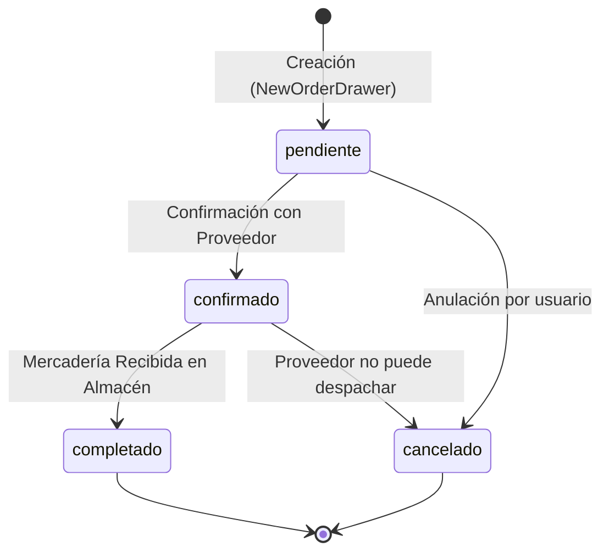

# 📜 Especificación de Reglas de Negocio (Business Rules)

Este documento centraliza y formaliza todas las **reglas de negocio, fórmulas financieras, restricciones de validación y transiciones de estado** que rigen el comportamiento de **StorePointWeb**.

---

## 📑 Índice de Dominios de Negocio

| Código | Dominio | Alcance | Archivos de Código Fuente |
| :--- | :--- | :--- | :--- |
| **RN-01** | [[#RN-01 Órdenes de Compra a Proveedores\|Órdenes de Compra]] | Ciclo de vida, editabilidad, PDF y recepción | `features/purchase-orders/purchase-orders.data.ts` |
| **RN-02** | [[#RN-02 Créditos a Clientes Cuentas por Cobrar\|Créditos y Cobranzas]] | Cuotas, frecuencias, mora y amortización | `features/credits/credits.data.ts` |
| **RN-03** | [[#RN-03 Punto de Venta POS y Carrito\|Ventas y Checkout]] | Subtotales, stock, métodos de cobro | `features/sale/sale.component.ts`, `cart-drawer` |
| **RN-04** | [[#RN-04 Control de Caja y Arqueo\|Caja Chica]] | Apertura, balance, ingresos/egresos y cierre | `features/caja/caja.component.ts` |
| **RN-05** | [[#RN-05 Clientes y Líneas de Crédito\|Gestión de Clientes]] | DNI, teléfono único y límites | `core/services/customer.service.ts` |
| **RN-06** | [[#RN-06 Inventario y Proveedores\|Inventario y Proveedores]] | RUC, existencias mínimas y unidades | `features/suppliers/`, `features/sale/` |

---

## RN-01: Órdenes de Compra a Proveedores

### 1.1 Máquina de Estados del Ciclo de Vida
Una orden de compra transita estrictamente a través de los siguientes estados:

### 1.2 Reglas Específicas de Transición:
- **RN-01.1 (Editabilidad)**:
  - Una orden **solo puede editarse** si su estado es `pendiente` (`isOrderEditable()`).
  - Una vez pasa a `confirmado` o `completado`, los ítems, precios y cantidades quedan **bloqueados** contra modificaciones accidentales.
- **RN-01.2 (Generación y Descarga de PDF)**:
  - Solo se permite exportar o descargar el PDF formal de orden (`canDownloadPdf()`) si el estado es `confirmado` o `completado`. Las órdenes en estado `pendiente` no tienen validez legal/fiscal para despacho.
- **RN-01.3 (Recepción de Inventario)**:
  - Al marcar una orden como `completado`, el sistema debe registrar el ingreso físico de mercadería incrementando automáticamente el `stock` de cada producto en el catálogo.

---

## RN-02: Créditos a Clientes (Cuentas por Cobrar)

El módulo de créditos modela las ventas a plazo ("al fiado") permitiendo financiamiento directo del comercio.

### 2.1 Fórmulas Matemáticas Financieras:
- **Monto a Financiar**:
  $$\text{Monto Financiado} = \text{Total Venta} - \text{Abono Inicial}$$
- **Monto de Cada Cuota**:
  $$\text{Valor Cuota} = \frac{\text{Total} - \text{Abono Inicial}}{\text{Número de Cuotas}}$$
- **Total Pagado Acumulado**:
  $$\text{Total Pagado} = \text{Abono Inicial} + (\text{Cuotas Pagadas} \times \text{Valor Cuota})$$
- **Porcentaje de Amortización**:
  $$\% \text{ Pagado} = \frac{\text{Total Pagado}}{\text{Total del Crédito}} \times 100$$

### 2.2 Reglas de Frecuencia y Fechas de Vencimiento (`addFrequencyPeriods`):
- **Semanal**: Cada cuota vence exactamente **7 días** después de la fecha base.
- **Quincenal**: Cada cuota vence exactamente **15 días** después de la fecha base.
- **Mensual**: Cada cuota vence el mismo día del mes siguiente (**+1 mes calendario**).

### 2.3 Reglas de Estado de Crédito (`CreditStatus`):
- **`active` (Al Día)**: La fecha actual es menor a la fecha de la próxima cuota exigible y aún existen cuotas pendientes.
- **`overdue` (En Mora / Vencido)**: La fecha actual es mayor a la fecha prevista de pago de la cuota en turno y dicha cuota no ha sido liquidada. Dispara badge rojo y alerta visual en la UI.
- **`completed` (Liquidado)**: `paidInstallments === installments` y el saldo remanente es $0.00$.

---

## RN-03: Punto de Venta (POS) y Carrito

### 3.1 Restricciones de Existencias (Stock)
- **RN-03.1 (Límite de Agotamiento)**: Un usuario no puede agregar al carrito una cantidad superior al `stock` disponible en almacén:
  $$\text{Cantidad en Carrito} \le \text{Stock Actual}$$
- **RN-03.2 (Alerta de Stock Crítico)**: Si el stock disponible es menor o igual a 5 unidades, se debe mostrar un indicador visual de advertencia (`warning`).

### 3.2 Modalidades de Cobro en el Checkout (`CartDrawerComponent`):
1. **Contado Efectivo**: El cliente paga en ventanilla. El monto cobrado impacta directamente en la caja chica activa ([[#RN-04 Control de Caja y Arqueo|RN-04]]).
2. **Digital / Tarjeta**: Requiere confirmación de transacción (voucher/referencia).
3. **Crédito**:
   - **Requisito Obligatorio**: Es mandatorio vincular un `Customer` registrado con teléfono o DNI. No se permiten ventas a crédito a clientes anónimos.
   - Genera automáticamente un nuevo registro en el módulo de Créditos ([[#RN-02 Créditos a Clientes Cuentas por Cobrar|RN-02]]).

---

## RN-04: Control de Caja y Arqueo

### 4.1 Fórmulas de Arqueo y Balance en Tiempo Real:
$$\text{Saldo Teórico Actual} = \text{Saldo Inicial} + \sum \text{Ingresos} - \sum \text{Egresos}$$

- **Saldo Inicial**: Monto en efectivo con el que se inicia la jornada operativa (fondo de cambio).
- **Ingresos**: Ventas al contado en efectivo registradas por el POS + entradas manuales de dinero.
- **Egresos**: Pagos a repartidores, compra de insumos rápidos o retiros autorizados de efectivo.

### 4.2 Reglas de Operación:
- **RN-04.1 (Bloqueo de Venta sin Caja Abierta)**: Para realizar ventas al contado en ventanilla, el estado de la caja debe ser `abierta`.
- **RN-04.2 (Cierre / Corte de Caja)**: Al finalizar el turno, el cajero ingresa el conteo de billetes y monedas físicos:
  - Si $\text{Conteo Físico} > \text{Saldo Teórico}$: Se registra como **Sobrante**.
  - Si $\text{Conteo Físico} < \text{Saldo Teórico}$: Se registra como **Faltante**.

---

## RN-05: Clientes y Líneas de Crédito

- **RN-05.1 (Identificador Único)**: Todo cliente debe contar con un número de teléfono celular válido (9 dígitos en Perú) y opcionalmente DNI (8 dígitos). El teléfono actúa como identificador rápido en ventanilla.
- **RN-05.2 (Búsqueda en Ventanilla)**: La búsqueda en el checkout (`CustomerService.search()`) busca concurrentemente por nombre, teléfono o DNI, retornando un máximo de 6 coincidencias para no sobrecargar la vista móvil.

---

## RN-06: Inventario y Proveedores

- **RN-06.1 (Identificación Fiscal de Proveedor)**: Todo proveedor mayorista debe poseer un número de RUC (Registro Único de Contribuyentes de 11 dígitos) y una categoría asignada (Abarrotes, Bebidas, Lácteos, Carnes, etc.).
- **RN-06.2 (Unidades de Venta)**: Los productos tienen asignada una unidad de medida oficial (`saco`, `bolsa`, `botella`, `caja`, `kg`, `unidad`). Las cantidades fraccionarias se restringen según el tipo de unidad (ej. botellas o cajas no admiten decimales).

---

## 🔗 Referencias
- [[Features MOC]]
- [[Architecture/State Management]]
- [[POS & Sales]]
- [[Purchase Orders]]
- [[Customer Credits]]
- [[Cash Register (Caja)]]
