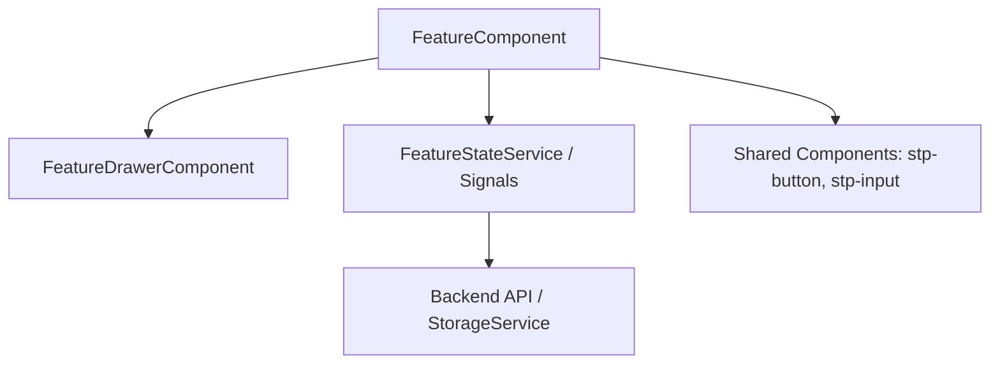

# Feature: {{feature_name}}

## 📌 Resumen Ejecutivo
Breve descripción de qué hace esta funcionalidad, quién es el usuario objetivo y el valor que aporta al negocio de StorePoint.

## 🧭 Mapa de Navegación & Rutas
- **Ruta principal**: `{{route}}`
- **Rutas secundarias / Modales**:
- **Guardias activas**: `AuthGuard`, etc.
- **MOC Padre**: [[Features MOC]]

## 👥 Casos de Uso & Flujos de Usuario
1. **Flujo 1**: El usuario accede a la vista...
2. **Flujo 2**: El usuario realiza una acción clave...

## 🏗️ Arquitectura Técnica del Módulo

### Componentes Involucrados
- **Contenedor Principal**: `FeatureComponent` (`src/app/features/...`)
- **Drawers / Modales**: Utilizan `MatBottomSheet` (ver [[Modal & Drawer Pattern]])
- **Componentes Compartidos Utilizados**:
  - [[UI Components Catalog#stp-button|stp-button]]
  - [[UI Components Catalog#stp-input|stp-input]]

### Estado y Datos
- **Manejo de Estado**: Angular Signals (`signal()`, `computed()`, `effect()`)
- **Modelos de Datos**: `src/app/core/models/...`
- **Mock Data**: `src/app/features/.../*.data.ts`

## 🔌 Integraciones & Servicios
- [[State Management#LoadingService|LoadingService]]: Incremento/decremento para spinner global
- [[Mobile & Capacitor#StorageService|StorageService]]: Persistencia local/nativa
- Backend Endpoints: `POST /api/v1/...`

## 🧪 Estrategia de Pruebas
- [ ] Pruebas unitarias del componente (`*.spec.ts` con Vitest)
- [ ] Validación de estados de carga (`LoadingService`)
- [ ] Compatibilidad móvil (Safe areas, viewport táctil)

## 📝 Tareas Pendientes (Checklist)
- [ ] Implementar UI con componentes compartidos
- [ ] Conectar signals reactivos
- [ ] Crear drawer con `MatBottomSheet`
- [ ] Conectar servicio backend
